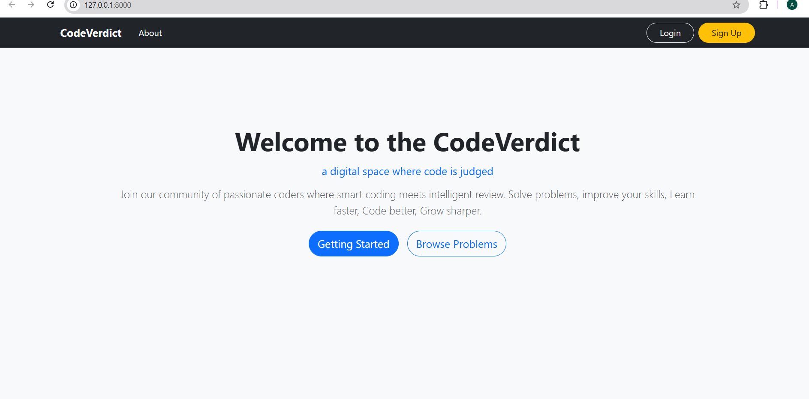
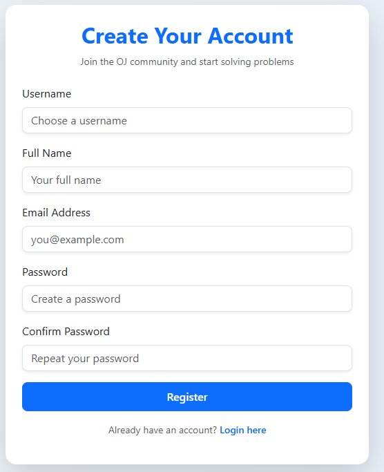
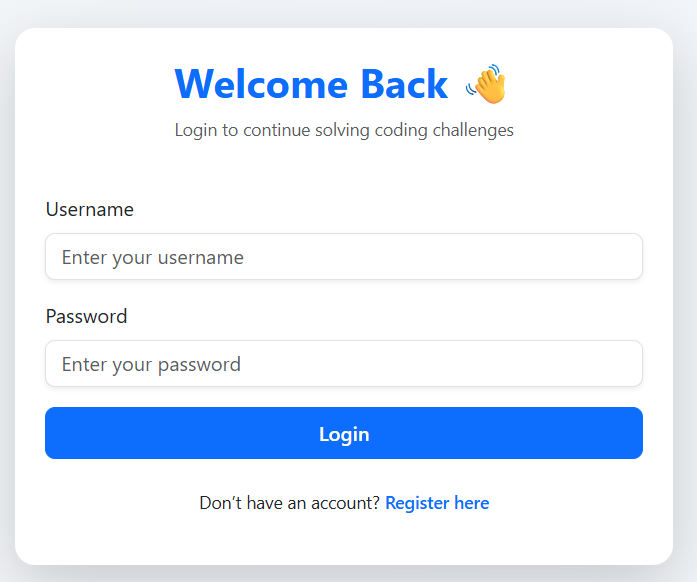
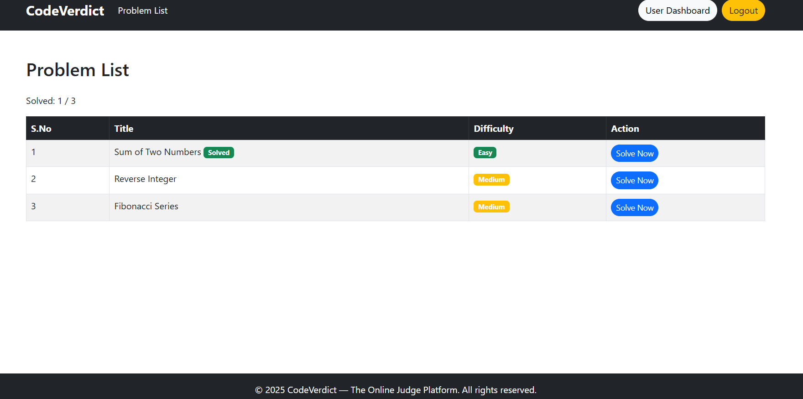
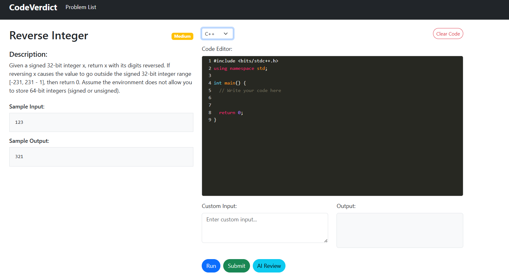
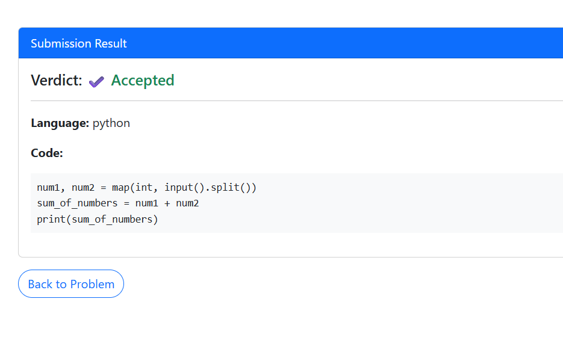
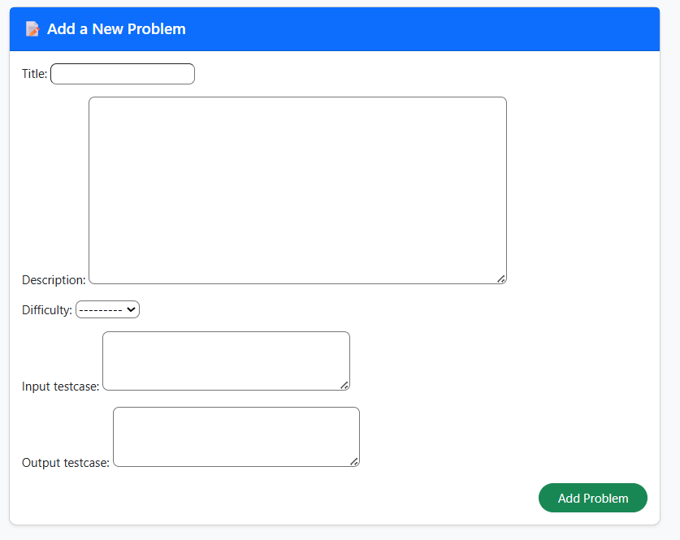
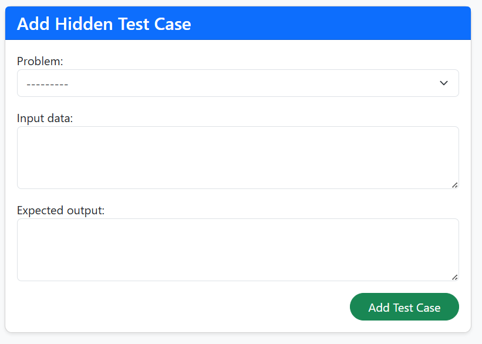
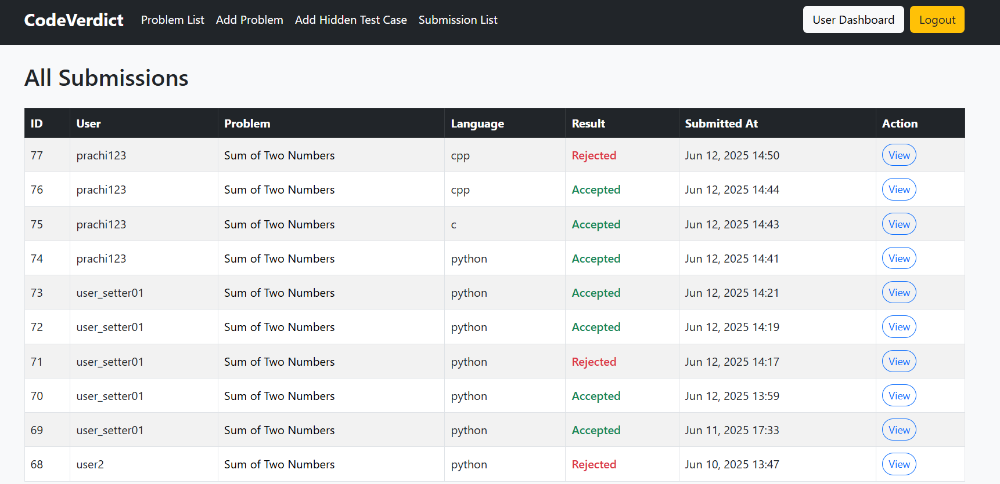

# 🧑‍💻 CodeVerdict (OJ-Project)

A full-featured Online Judge platform built with **Django**, designed to help users practice programming by solving coding problems, executing their code in isolated Docker containers, and receiving AI-powered feedback(using Gemini API).

---

## 🔧 Tech Stack

- **Backend:** Django (Python)
- **Frontend:** HTML, CSS, Bootstrap
- **Languages Supported:** Python, C, C++
- **Code Execution:** Isolated environments via Docker + `subprocess`
- **AI Review:** Solution feedback based on problem description(using Gemini API)
- **Containerization:** Docker
- **Deployment:** AWS EC2 + Amazon ECR (Elastic Container Registry)

---

## 👥 User Roles

### 🔹 Normal User
- Register and log in
- View coding problems
- Track progress: “x/y Solved”
- Interact with code editor:
  - `Run` code with custom input
  - `Submit` for evaluation via hidden test cases
  - Get `AI Review` of submitted code
- View submission history (`My Submissions`)
- View personal profile (`My Profile`)

### 🔸 Problem Setter
- All Normal User features
- Add new coding problems
- Add hidden test cases
- View all user submissions

### 🔺 Admin
- Full platform control (extendable for moderation, analytics, etc.)

---

## 🚀 Key Features

- 🔐 **Role-Based Authentication** (Normal, Setter, Admin)
- 📚 **Problem Dashboard** with Solved/Total view
- 🖊️ **In-browser Code Editor** with support for C, C++, Python
- ⚙️ **Run Code** with custom input
- ✅ **Submit Code** evaluated against hidden test cases
- 🤖 **AI Code Review** for quality feedback
- 📊 **User Progress Tracking**
- 👁️ **Submission History**
- 🐳 **Secure Code Execution via Docker Containers**

---

## 🐳 Docker Integration

Docker ensures secure and isolated code execution. Each code run or submission spins up a Docker container to:
- Avoid malicious code execution risks
- Provide language-specific environments
- Improve system scalability

> ✅ Docker must be installed and running for local development.

---

## ☁️ Deployment (AWS EC2 + ECR)

The system is containerized and deployed to the cloud via:
- **Amazon EC2**: Hosts the main Django app
- **Amazon ECR**: Stores and pulls Docker images used in code execution

### 🛠️ Deployment Summary
- Docker image of the project is pushed to **Amazon ECR**
- EC2 instance pulls and runs the image

---

## 📸 Screenshots

